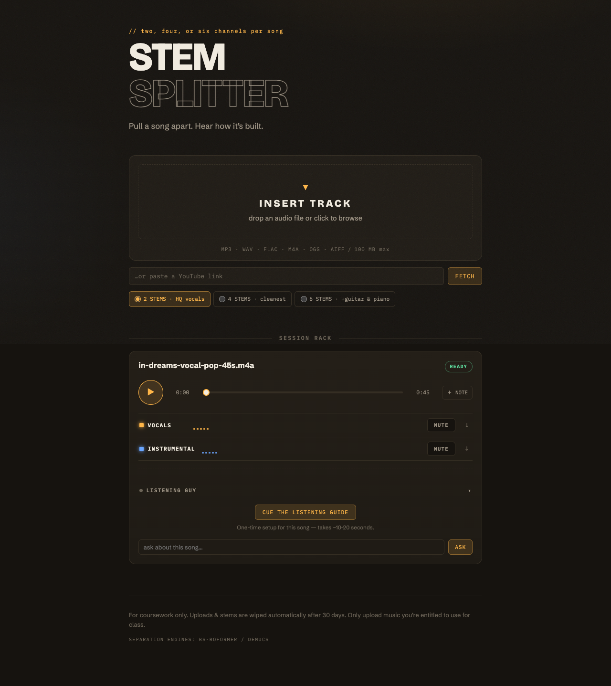
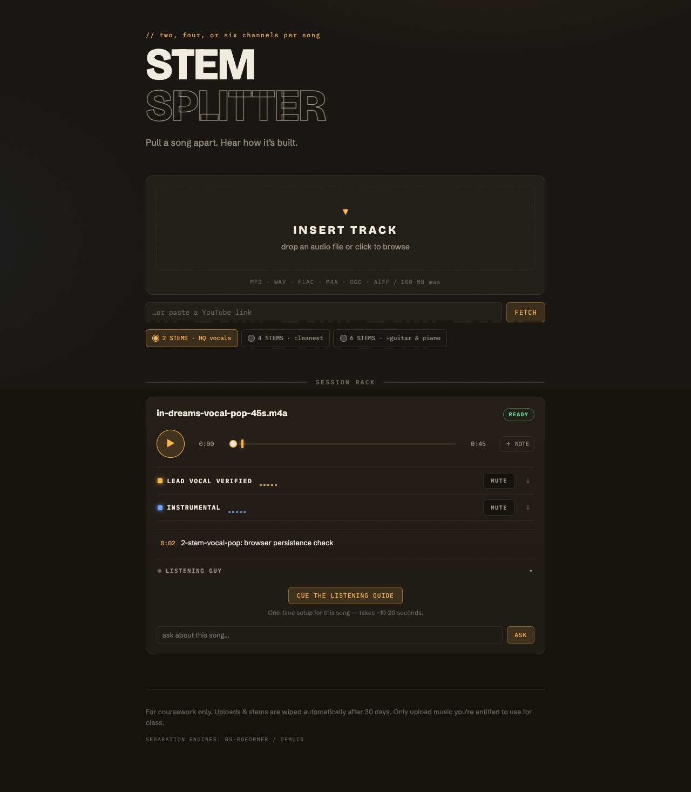
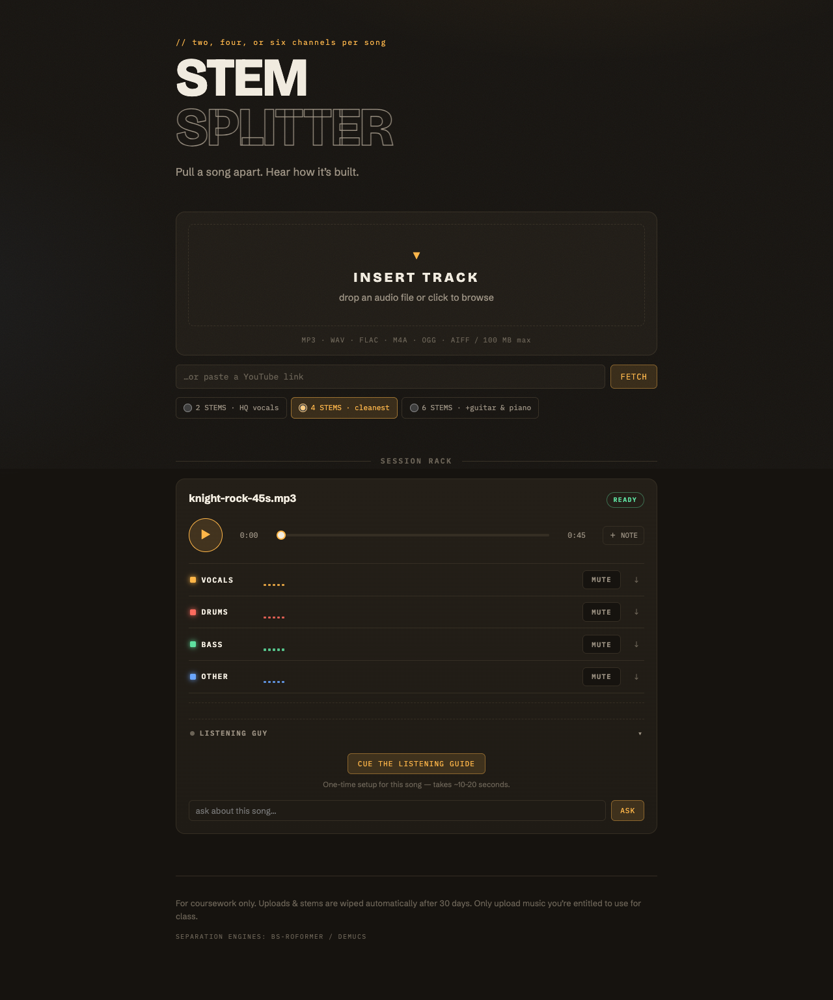
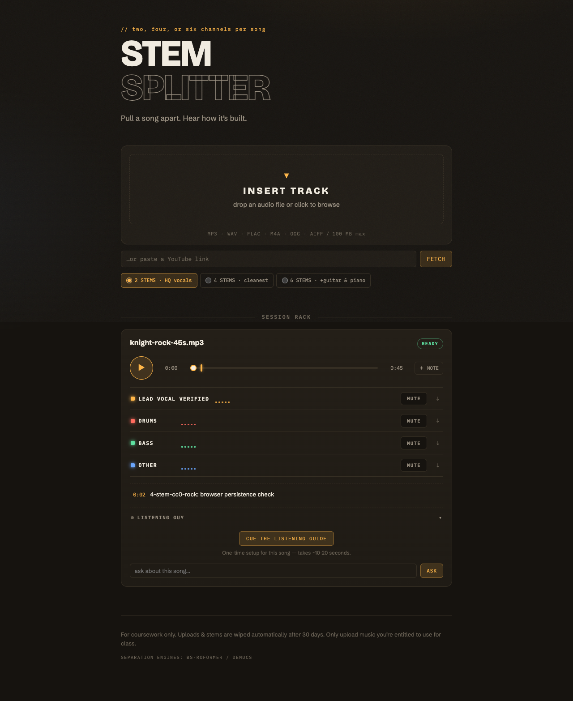
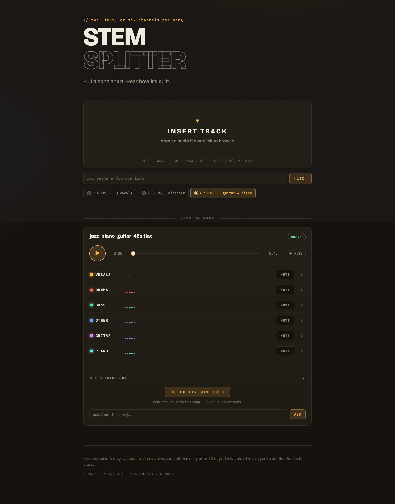
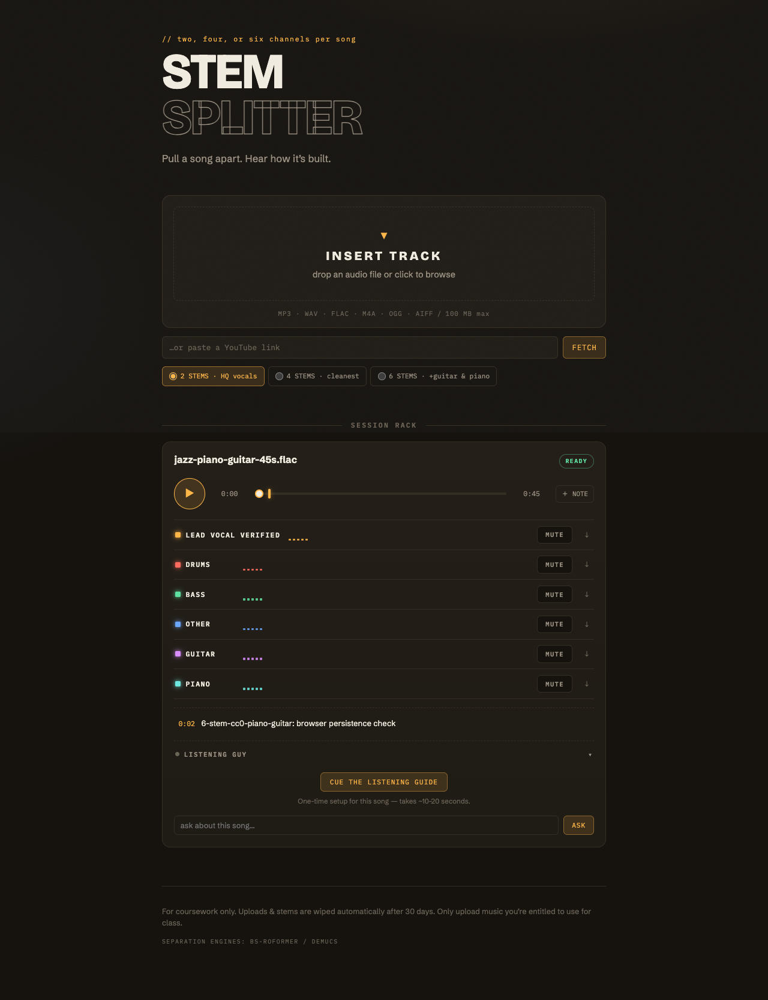
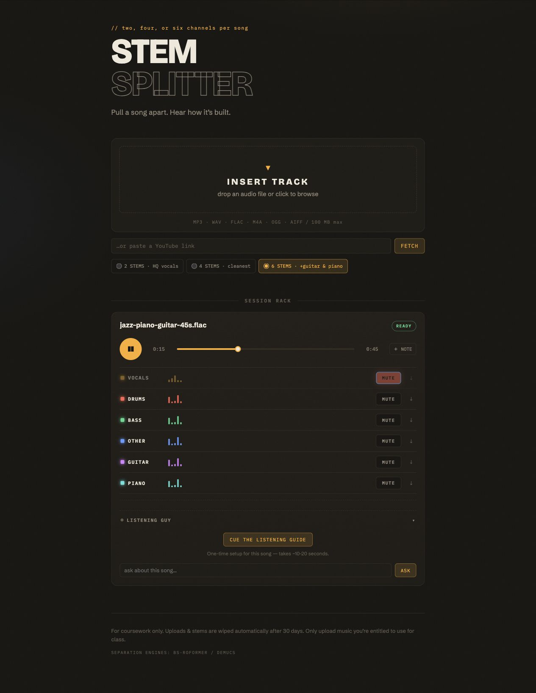

# Real-audio 2/4/6-stem acceptance — 2026-07-28

## Outcome

All three locally supported separation profiles completed through the visible
browser UI with real 45-second music excerpts:

| Case | Model | Source variation | Result | Browser-to-ready |
| --- | --- | --- | --- | ---: |
| 2 stems | `bs_roformer_vocals` | vocal pop, M4A | vocals + instrumental, two distinct 45.0 s MP3s | 16.731 s |
| 4 stems | `htdemucs_ft` | electric-guitar rock, MP3 | vocals + drums + bass + other, four distinct 45.0 s MP3s | 20.756 s |
| 6 stems | `htdemucs_6s` | piano/guitar beat, 24-bit FLAC | vocals + drums + bass + other + guitar + piano, six distinct 45.0 s MP3s | 10.704 s |

Every case passed model selection, upload, terminal-state polling, audio
metadata, synchronized play, seek, pause, vocals mute/unmute, channel rename,
timestamped note creation, every stem download, distinct output hashes, and
rename/note persistence after a full reload. Browser warning/error capture was
empty for all three cases. The exact job IDs, source hashes, durations, output
sizes, output hashes, and screenshot filenames are in each case's
[`result.json`](2-stem-vocal-pop/result.json),
[`result.json`](4-stem-cc0-rock/result.json), and
[`result.json`](6-stem-cc0-piano-guitar/result.json).

## Source record

The source audio and separated output audio are intentionally not committed.
Only screenshots, hashes, sizes, durations, and machine-readable result records
are retained here.

| Case | Excerpt | Source and rights record | Bytes | SHA-256 |
| --- | --- | --- | ---: | --- |
| 2-stem vocal pop | Roy Orbison, “In Dreams,” 00:35–01:20 | [Official Roy Orbison page](https://royorbison.com/roy-orbisons-in-dreams-music-video-directed-by-david-lynch/); copyrighted evaluation source, used locally and not redistributed | 1,099,633 | `2a1c07d3d0af030e33b0f56a55d312da2596b99f0a27d7ba5b14bb1a0fe82c4a` |
| 4-stem rock | “Knight,” 00:10–00:55 | [OpenGameArt source page](https://opengameart.org/content/knight-8), credited there to Pro Sensory/Alex McCulloch under CC0 | 1,081,561 | `bf8cdfc856c994b9bdec6b27b2ce9ede5dc9ba7ae0bd411cf73c870878dd675e` |
| 6-stem piano/guitar | “Jazz Piano Gangsta Beat Plus Guitar - 70 bpm,” 00:30–01:15 | [Internet Archive collection](https://archive.org/details/41beatsbyTMCG), creator Thomas McGrath/TMCG, CC0 metadata | 8,085,030 | `1e0139481b0960925a1e9e38eb11016c801bb7e1afffc81a7268e8c5e30ac1d6` |

## Adversarial findings and fixes

The acceptance work did not treat a recovered UI as a clean pass. It exposed
and closed these issues:

1. Local uploads could be buffered without a trustworthy upper bound. The
   local route now requires a fixed `Content-Length`, rejects oversized
   declarations before reading, verifies the stored size, and deletes
   mismatches.
2. Locally stored source audio needed a private provider handoff and an
   expiration policy. Source URLs are now short-lived HMAC-signed URLs, and
   local uploads/stems are deleted after 30 days.
3. Malformed percent-encoded object paths could throw during decoding. They now
   fail closed with 404 responses.
4. The global processing banner could remain after all jobs were terminal. It
   now hides only when every retained job is done.
5. The browser job list discarded the selected model. It now stores the model,
   and every real run verifies that stored value. After reload, the radio group
   returns to the backend default for the *next* upload; the completed job keeps
   its original model and exact stem set.
6. Streamed local source/stem responses lacked an explicit response length and
   could trigger a local Wrangler proxy disconnect. Both now send
   `Content-Length`.
7. A completion webhook and the browser reconciliation poll could ingest the
   same result concurrently. D1 now atomically claims an `ingesting` state, so
   only one path writes stems. The claim carries a five-minute internal lease;
   a later poll recovers an expired lease if a Worker was interrupted.
8. A transient provider stem fetch could make the webhook return 500 after
   partially ingesting a result. Retryable network, 429, and 5xx failures now
   get three bounded attempts; permanent 4xx failures still fail immediately.
   The real-run gate rejects webhook 5xx responses and delivery failures even
   if polling later recovers.
9. Reload initialization, finite CSS entrance animations, and restored scroll
   position could make the screenshot record misleading. The E2E harness now
   clears state once per session, disables finite animations for captures, and
   pins the persisted screenshot to the document top.
10. The separator wrapper could outlive the test runner. The service now handles
    `SIGINT`/`SIGTERM` gracefully, and every final run left ports 8765 and 8787
    closed.
11. Dependency audit findings were removed by updating Hono, Wrangler, and the
    Cloudflare worker types. The final audit reports zero vulnerabilities.

Mocked E2E regression coverage additionally proves chunked upload rejection,
oversized-body short-circuiting, length-mismatch cleanup, 30-day retention,
concurrent webhook/poll deduplication, transient stem-download retry, malformed
path handling, response `Content-Length`, exact model persistence, playback,
and local R2 readback.

## Evidence index

Each automated case contains six full-page captures:

1. `01-processing.png`
2. `02-ready.png`
3. `03-playing.png`
4. `04-vocals-muted.png`
5. `05-annotated-renamed.png`
6. `06-persisted-after-reload.png`

The six-stem directory also contains
`07-in-app-browser-playing-muted.png`, a separate final spot check in the
Codex in-app browser. It showed six channels playing at 00:15 with vocals muted,
no browser warnings/errors, and a 200 completion webhook.

### Two-stem vocal pop





### Four-stem CC0 rock





### Six-stem CC0 piano/guitar







## Log and environment audit

- Final webhook status: 200 in the 2-, 4-, and 6-stem runs.
- Browser warnings/errors: none in all three automated runs and the in-app
  browser spot check.
- Server failure signatures rejected by the runner: webhook 5xx, internal
  server errors, network disconnects, webhook delivery failures, and Python
  tracebacks.
- The only final warning was Audio Separator's M4A bit-depth probe falling back
  to 16-bit for the “In Dreams” input. FFmpeg decoded it successfully and both
  outputs were distinct, exactly 45.0 seconds, and fully playable.
- Generated service logs remain local and are ignored by Git; this scratchpad
  records the reviewed findings without committing temporary paths or signed
  file tokens.
- Model checkpoints, source music, and separated audio remain local and are not
  part of the pushed change.
- Clean install: `npm ci` completed and audited 104 packages.
- Dependency audit: `npm audit --audit-level=low` found zero vulnerabilities.
- Unit/service gate: seven Worker tests and five Python service tests passed.
- Mocked browser gate: ten tests passed; the environment-gated real-audio
  spec was intentionally skipped in that command and run separately for all
  three cases above.
- Worker packaging: Wrangler 4.114.0 production dry run completed successfully.
- Artifact checksum verification and `git diff --check` both passed.

## July 30 blank-track regression

The model choices now state their outputs directly. The browser builds those
choices from the Worker response, and each job carries the expected names into
its processing state. The full-pipeline smoke command no longer contains a
default song. Its caller must supply a YouTube URL they are allowed to test.

The Worker now requires the exact output set selected for the job. Missing,
repeated, or unexpected names fail before the mixer appears. Each download must
also contain an MP3 frame. Empty or non-audio responses are retried three times,
then the job fails and removes any partial files from that ingestion attempt.
If a stored track later becomes unavailable, the mixer names it `NO AUDIO`,
changes the job badge to `AUDIO ERROR`, and disables synchronized playback.

The adversarial browser suite verified an incomplete six-track provider result
and an empty bass response. The incomplete job showed `FAILED` with zero
channels. The empty response failed after three checks and removed the vocals
and drums files written earlier in the attempt.

The actual separator was then rerun with the three recorded sources.

| Choice | Model | Browser-to-ready | Output check |
|---|---|---:|---|
| 2 tracks | `bs_roformer_vocals` | 21.073 s | vocals and instrumental, distinct non-empty MP3s |
| 4 tracks | `htdemucs_ft` | 20.673 s | vocals, drums, bass, other, distinct non-empty MP3s |
| 6 tracks | `htdemucs_6s` | 11.045 s | vocals, drums, bass, other, guitar, piano, distinct non-empty MP3s |

Every output was 45 seconds long. The expected names matched the rendered names,
and the browser message arrays were empty. Desktop and 390-pixel mobile checks
also showed all direct labels, a working six-track selection, and no browser
warnings or errors.

Wrangler was not authenticated for the remote Cloudflare account, so this pass
did not inspect Agustina's production job records. The fix and regression tests
address the concrete code paths that allowed incomplete or empty results to
appear ready without claiming that the earlier production cases were recovered.

## Reproduction

Run one isolated real-audio case with:

```bash
SOURCE_AUDIO=/absolute/path/to/track.ext \
MODEL=htdemucs_6s \
CASE_SLUG=my-six-stem-case \
REAL_AUDIO_ARTIFACT_DIR=output/playwright/real-audio/my-six-stem-case \
npm run test:e2e:real:run
```

Supported model values are `bs_roformer_vocals`, `htdemucs_ft`, and
`htdemucs_6s`. The runner creates isolated D1/R2 state, syncs the locked Python
environment, starts the separator and Worker, runs the visible browser flow,
audits fatal log signatures, and shuts down both services.

The final repository gate is:

```bash
npm ci
npm audit --audit-level=low
npm run test
npm run test:e2e
npx wrangler deploy --dry-run
git diff --check
```

Artifact hashes are listed in [`SHA256SUMS`](SHA256SUMS).
